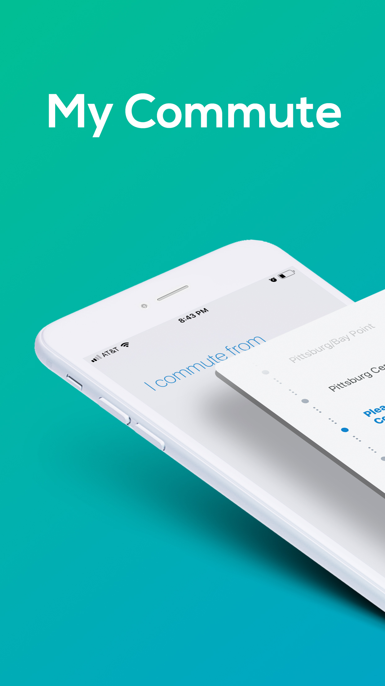
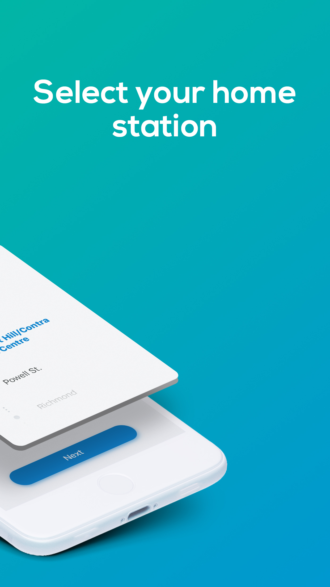
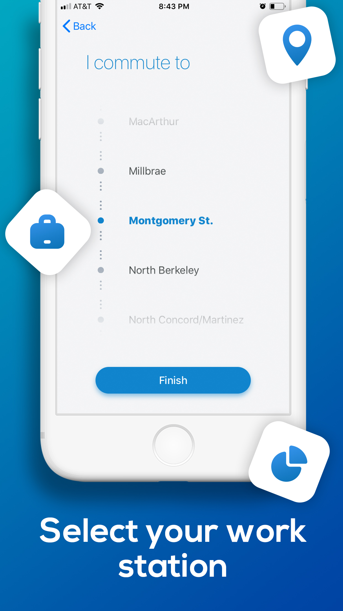
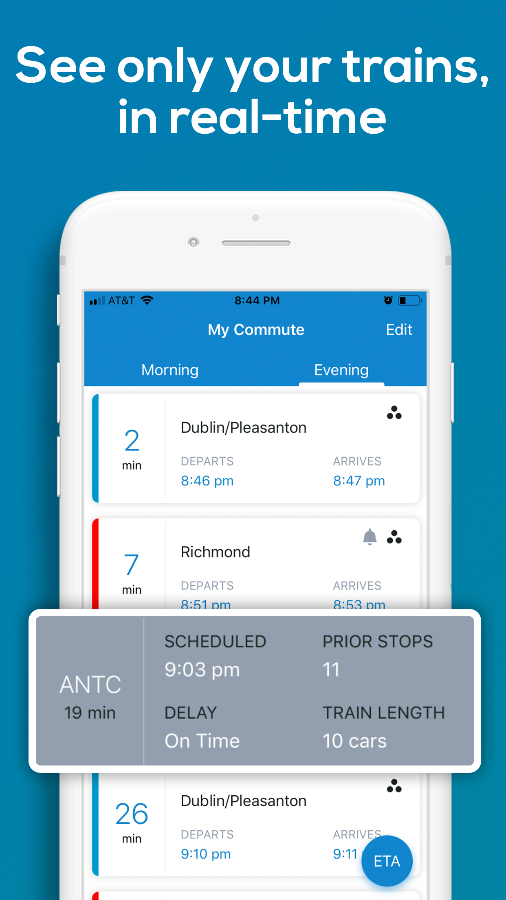
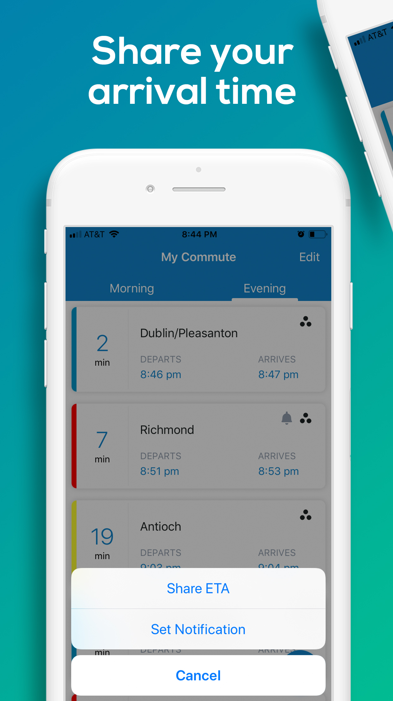
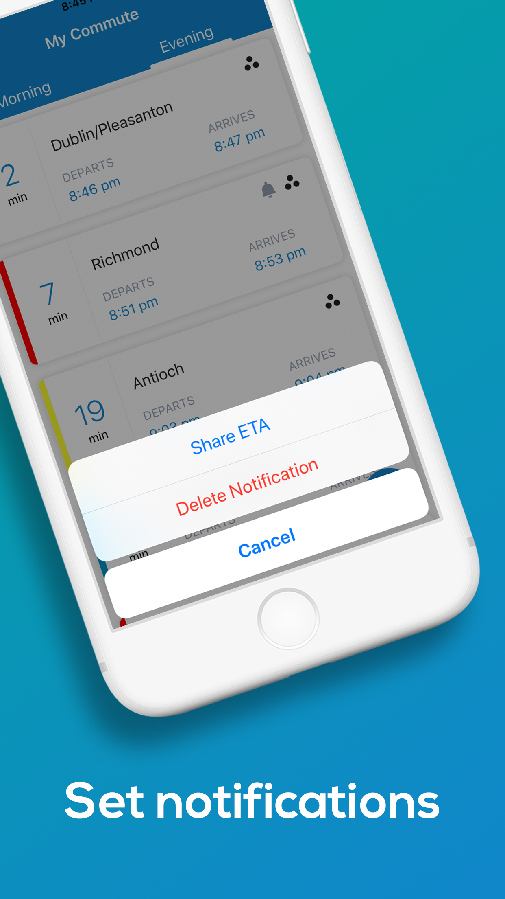

# Commuter-iOS
Intuitive BART transit app for the SF Bay Area daily commuter.

  <   

### Features
- Set your commute with two quick taps
- See only the trains you care about, with real-time departures
- Set notifications for your favorite trains
- Share your real-time ETA with loved ones
- Identify empty trains for a more comfortable commute
- No sign-up necessary

### Roadmap
- Support commutes requiring station transfer
- Predict car occupancy based on ridership data

### Credits
- Commuter's backend is powered by Elixir and Phoenix 🤩 https://github.com/wfgilman/commuter
- Usage analytics: [Mixpanel](https://mixpanel.com)
- In-app banners: https://github.com/Daltron/NotificationBanner
- Onboarding picker view: https://github.com/filipealva/PickerView
- App Design: https://www.fiverr.com/paudmartins
- App Store Preview Design: https://www.fiverr.com/armanimughal

### Feedback
PRs and feedback welcome!
